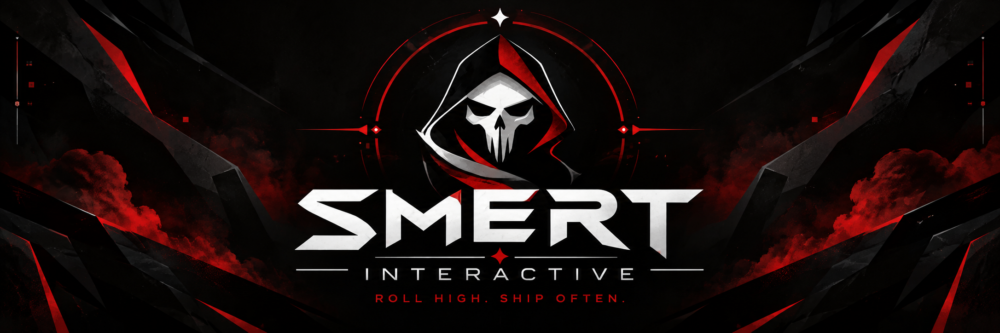

<div align="center">



<br>

### Мы бросаем кубы. Мы пишем код.
*Иногда именно в таком порядке.*

[](https://github.com/Smert-Interactive)


<br>

> **Небольшая команда, которая делает вещи, которыми сама хотела бы пользоваться.**

</div>

---

## 🎲 DiceBound

> ### Твой персонаж. Твоя система. Твои правила.

**DiceBound** — универсальная платформа для создания и хранения листов персонажей настольных ролевых игр.

Не очередной конструктор исключительно для D&D.

Мы создаём систему, в которой листы персонажей **модульные, управляются схемами и могут адаптироваться под разные НРИ** — от существующих игровых систем до полностью пользовательских.

<br>

<table>
<tr>
<td>🧩 <b>Модульные листы</b></td>
<td>Листы персонажей собираются из переиспользуемых компонентов</td>
</tr>

<tr>
<td>⚙️ <b>Пользовательские системы</b></td>
<td>Можно создавать собственные шаблоны для различных НРИ</td>
</tr>

<tr>
<td>🧮 <b>Вычисляемые поля</b></td>
<td>Производные характеристики и значения на основе формул</td>
</tr>

<tr>
<td>📜 <b>История версий</b></td>
<td>Изменения персонажа сохраняются между ревизиями</td>
</tr>

<tr>
<td>🔍 <b>Сравнение версий</b></td>
<td>Можно увидеть, что именно изменилось между ревизиями</td>
</tr>

<tr>
<td>🔗 <b>Совместный доступ</b></td>
<td>Листы можно открывать для просмотра или редактирования</td>
</tr>

<tr>
<td>🗃️ <b>Гибкие данные</b></td>
<td>Структура персонажей хранится в PostgreSQL JSONB</td>
</tr>
</table>

---

## 🛠️ Что под капотом

<div align="center">


<br>

**React · TypeScript · PostgreSQL · Docker**

<br>

…и неприлично большое количество Markdown.

</div>

---

## 🧙 Наша партия

Группа разработчиков, которые делают вид, будто разработка программного обеспечения значительно предсказуемее броска d20.

<table>
<tr>
<td width="50%" valign="top">

### 🎯 Текущий квест

> **Сделать DiceBound и случайно не создать распределённый монолит.**

**Сложность:** вероятно, выше ожидаемой.

</td>

<td width="50%" valign="top">

### 🎲 Текущее состояние

<pre>
Планирование   ██████████
Разработка     ███████░░░
Документация   ██████░░░░
Рассудок       ██░░░░░░░░
</pre>

</td>
</tr>
</table>

---

## ⚔️ Философия разработки

```bash
$ git checkout -b feat/something-cool

> написать код
> сломать всё
> пересмотреть жизненные решения
> починить всё
> открыть pull request
> получить эмоциональный урон на code review
> merge

Достижение разблокировано:
"У меня на компьютере работает"
